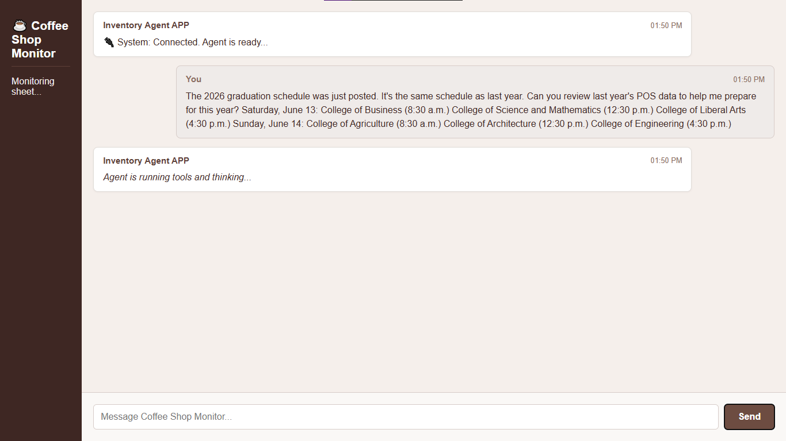
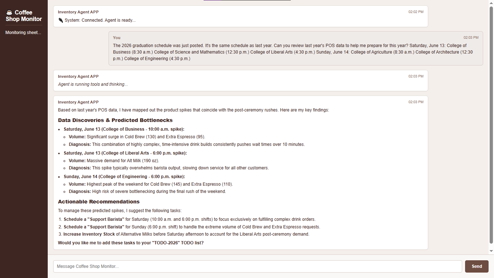

# ☕ Coffee Shop Management Agent

An AI-powered operational assistant built with Google Cloud Run and Gemini. The agent analyzes historical Point of Sale (POS) data stored in Google Sheets to generate inventory and staffing recommendations for upcoming events, and — with Human‑in‑the‑Loop confirmation — can automatically populate a `TODO-2026` tab in the target Google Sheet via the Google Sheets API.

---

## Features

- Real‑time conversational UI served from Cloud Run.
- Grounded context retrieval from Google Sheets POS data (historical sales by event).
- Automated task creation in Google Sheets (`TODO-2026` tab) through the Sheets API.
- Human‑in‑the‑Loop (HITL) confirmation before any spreadsheet modifications.
- Actionable deliverables: inventory counts, staffing suggestions, and prioritized TODOs.

---

## Agent workflow & evaluation demonstration

1. Step 1 — Input query  
   The user supplies the event schedule and asks the agent to prepare recommendations based on last year’s POS data. Example prompt:

   > "The 2026 graduation schedule was just posted. It's the same schedule as last year. Can you review last year's POS data to help me prepare for this year?  
   > Saturday, June 13: College of Business (8:30 a.m.) College of Science and Mathematics (12:30 p.m.) College of Liberal Arts (4:30 p.m.)  
   > Sunday, June 14: College of Agriculture (8:30 a.m.) College of Architecture (12:30 p.m.) College of Engineering (4:30 p.m.)"

2. Step 2 — Dashboard & prompt submission  
   The agent UI accepts the prompt and shows processing status.

   

3. Step 3 — Agent data analysis & output  
   - The agent queries the Google Sheets POS data (historical transactions), aggregates demand by ceremony, estimates peak coffee/pastry demand windows, and computes staffing and inventory recommendations.  
   - The assistant presents a concise, ranked set of recommendations (e.g., cups of coffee, pastries, number of baristas per shift, suggested start/finish times for setup/cleanup).

   

4. Step 4 — Automated spreadsheet update (HITL)  
   - If the user replies “Yes” to the agent’s confirmation prompt, the agent creates a `TODO-2026` tab (if not present) and writes actionable tasks into the sheet using the Google Sheets API.  
   - Example tasks: “Order 500 cups of coffee”, “Schedule 3 baristas for College of Business (8:00–10:30)”, prioritized and timestamped.

---

## Project structure

```text
coffee-shop-agent/
└── coffee-mgr-agent/
    ├── assets/
    │   ├── agent_op.png
    │   └── dashboard.png
    ├── Dockerfile
    ├── main.py
    ├── requirements.txt
    └── .gitignore
```

---

## Getting started — local setup

### Prerequisites
- Python 3.11+
- Google Cloud SDK (gcloud) authenticated
- Service account with Google Sheets read & write permissions
- Enable Google Sheets API for the project
- Docker (optional, for containerized runs)

### Quickstart
1. Clone the repo
```bash
git clone https://github.com/krithikashree1957/coffee-shop-agent.git
cd coffee-shop-agent/coffee-mgr-agent
```

2. Create and activate a virtual environment
```bash
python -m venv venv
source venv/bin/activate    # macOS / Linux
# venv\Scripts\activate     # Windows (PowerShell)
```

3. Install dependencies
```bash
pip install -r requirements.txt
```

4. Configure credentials & environment variables
- Create a Google service account JSON key and download it locally.
- Export environment variables (example):
```bash
export GOOGLE_APPLICATION_CREDENTIALS="/path/to/service-account.json"
export TARGET_SHEET_ID="your-google-sheet-id"
export AGENT_MODEL="gemini-3.6-flash"
# any other env vars your main.py expects (e.g., PORT, LOG_LEVEL)
```

5. Run locally
```bash
python main.py
```
- The app will open a local web UI (or print a local URL). Interact with the agent, provide the event prompt, review recommendations and confirm any sheet updates.

Notes
- The agent will always request a confirmation prompt (HITL) before writing to Sheets.
- Ensure the service account has permission to create/toggle sheets and edit the target spreadsheet.

---

## Deploying to Google Cloud Run

1. Authenticate and set project
```bash
gcloud auth login
gcloud config set project YOUR_GCP_PROJECT_ID
```

2. Build container and push (example with Cloud Build)
```bash
gcloud builds submit --tag gcr.io/$GOOGLE_CLOUD_PROJECT/coffee-mgr-agent
```

3. Deploy to Cloud Run
```bash
gcloud run deploy coffee-mgr-agent \
  --image gcr.io/$GOOGLE_CLOUD_PROJECT/coffee-mgr-agent \
  --platform managed \
  --region us-central1 \
  --allow-unauthenticated \
  --set-env-vars TARGET_SHEET_ID=$TARGET_SHEET_ID
```

4. Attach secrets / service account
- Use a Workload Identity or attach a service account to the Cloud Run service that has Sheets API access.
- Store any non-Google secrets in Secret Manager and mount or inject as env vars.

---

## Configuration & environment variables

Common environment variables used by main.py (adjust per implementation):
- GOOGLE_APPLICATION_CREDENTIALS — path to service account JSON (local)
- TARGET_SHEET_ID — Google Sheet ID for POS data and TODO-2026 write operations
- AGENT_MODEL — model identifier (e.g., gemini-3.6-flash)
- PORT — web server port

Security note: never commit service account keys or secrets to the repo. Use Secret Manager and IAM best practices in production.

---

## Operational considerations

- HITL safety: The agent will present a human confirmation prompt before performing any write operations. This ensures operators retain control.
- Logging & audit trail: All suggested writes should be logged and an audit entry recorded (timestamp, user confirmation, rows written).
- Permissions: Use least privilege for service accounts (Sheets edit + read only where needed).
- Testing: Validate the agent on a copy of your spreadsheet before running against production sheets.

---

## Troubleshooting

- Image or assets not visible: confirm paths are correct relative to README (e.g., `coffee-mgr-agent/assets/dashboard.png`).
- Google API errors: verify the service account has Sheets API enabled and the target sheet is shared with the service account email.
- Model connectivity: ensure network egress from Cloud Run to Gemini endpoint (or Google-hosted model endpoint) is allowed.

---

## License

This project is released under the MIT License. See LICENSE file for details.

---

Krithika Shree K

Author: Krithika Shree K

GitHub: [@krithikashree1957](https://github.com/krithikashree1957)
